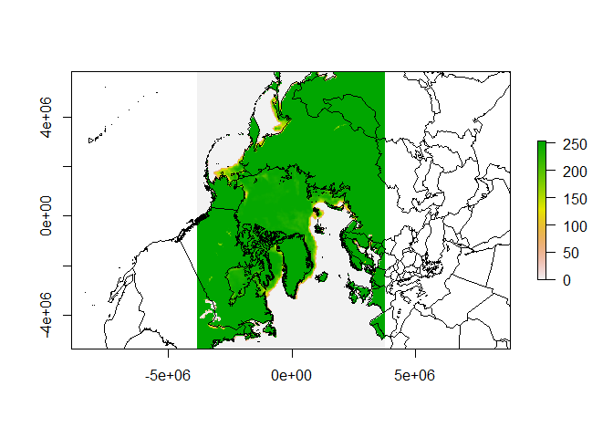
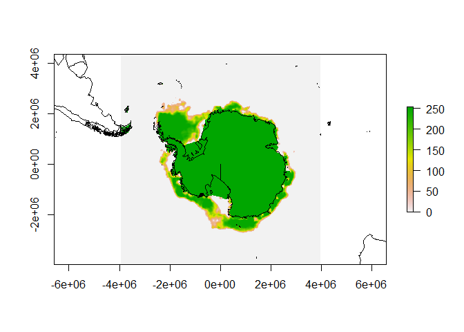

<!-- README.md is generated from README.Rmd. Please edit that file -->
NSIDC-seaice
============

NSIDC sea ice

Southern Hemisphere

<ftp://sidads.colorado.edu/pub/DATASETS/nsidc0051_gsfc_nasateam_seaice/final-gsfc/south/daily/2013/nt_20130114_f17_v01_s.bin>

Northern Hemisphere

<ftp://sidads.colorado.edu/pub/DATASETS/nsidc0051_gsfc_nasateam_seaice/final-gsfc/north/daily/2013/nt_20130105_f17_v01_n.bin>

``` r
## packages for read/plot/coast data
library(raster)

library(rgdal)
#> rgdal: version: 1.0-4, (SVN revision 548)
#>  Geospatial Data Abstraction Library extensions to R successfully loaded
#>  Loaded GDAL runtime: GDAL 1.11.2, released 2015/02/10
#>  Path to GDAL shared files: C:/R/R/library/rgdal/gdal
#>  GDAL does not use iconv for recoding strings.
#>  Loaded PROJ.4 runtime: Rel. 4.9.1, 04 March 2015, [PJ_VERSION: 491]
#>  Path to PROJ.4 shared files: C:/R/R/library/rgdal/proj
#>  Linking to sp version: 1.1-1
library(maptools)
#> Checking rgeos availability: TRUE
data(wrld_simpl)

## northern hemisphere
north <- raster("nt_20130105_f17_v01_n.vrt")
plot(north)
plot(spTransform(wrld_simpl, projection(north)), add = TRUE)
```




    ## southern hemisphere
    south <- raster("nt_20130114_f17_v01_s.vrt")
    plot(south)
    plot(spTransform(wrld_simpl, projection(south)), add = TRUE)


